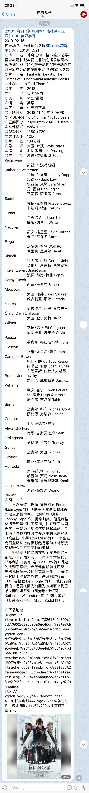
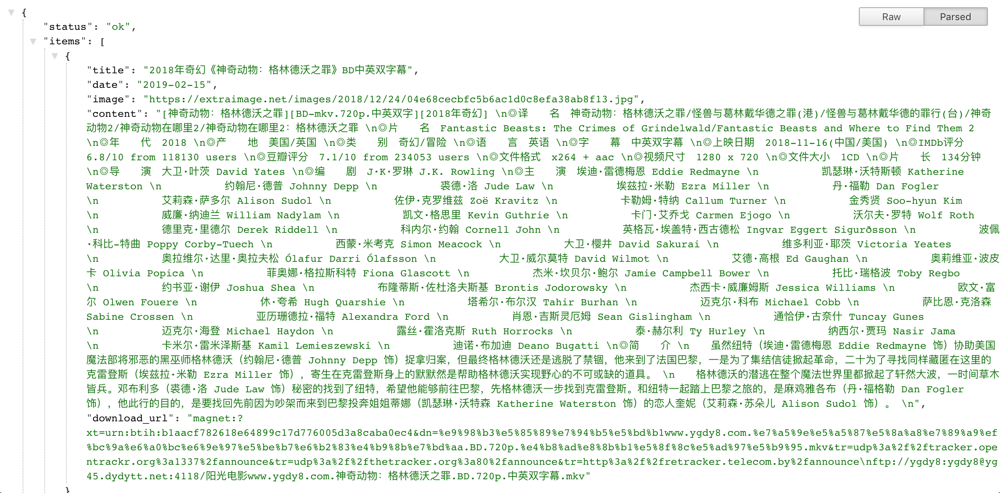

Telegram Bot Dytt
================

telegram bot 推送电影天堂最新电影

效果如下入所示
</img>

## 使用方法

### 部署服务端

#### 一、Docker (推荐使用)
1. 构建镜像 

   切换到dockerfile文件所在目录

   ```
   sudo docker build . -t movie_bot
   ```

2. 启动镜像

   ```bash
   sudo docker run -d -p 8000:8000 movie_bot
   ```

3. 发送 GET 请求 imgType 自己填写, 得到 json 数据

   ```bash
   http://{YOUR_SCRAPYRT_IP}:8000/crawl.json?start_requests=true&spider_name=movie
   ```
   

#### 二、本机环境

##### 1. 需要的环境

1. python 3+
2. scrapy
3. scrapyrt

##### 2. 步骤

1. 首先准备 scrapy 爬虫项目

2. 下载并安装 scrapyrt, 并用当前目录的 resources.py 替换项目中的 resources.py

3. 使用命令 scrapy crawl movie 确认爬虫可以正常使用后, 执行 scrapyrt -p 8000 开始在 8000 端口监听 web 请求

4. 发送 GET 请求 imgType 自己填写, 得到 json 数据

   ```
   http://{YOUR_SCRAPYRT_IP}:8000/crawl.json?start_requests=true&spider_name=movie
   ```

### 部署客户端
将 `GoogleScript`中的代码拷贝到 google script 平台上, 具体步骤推荐该视频: [Telegram bot 机器人编程系列](https://www.youtube.com/watch?v=SxwsGWlMfP4), 并且替换其中的 `YOUR_CHAT_ID`, `YOUR_BOT_TOKEN` 和 上一步搭建 `scrapyrt` 的服务端 ip地址 `YOUR_SCRAPYRT_IP`

## 备注

>:0: UserWarning: You do not have a working installation of the service_identity module: 'cannot import name opentype'. Please install it from https://pypi.python.org/pypi/service_identity and make sure all of its dependencies are satisfied. Without the service_identity module, Twisted can perform only rudimentary TLS client hostname verification. Many valid certificate/hostname mappings may be rejected.
```
pip install service_identity
```